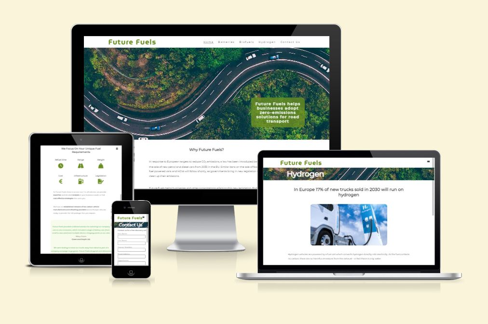
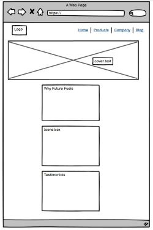
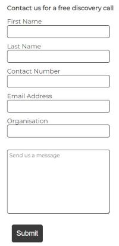

# Future Fuels

By Helen Murugan

[View the live site here](https://helenmurugan.github.io/future-fuels/)

* This document describes the development process for Future Fuels website. It is for educational purposes only, as my first milestone project for a Diploma in Full Stack Software Development (E-Commerce Applications) with Code Institute, using frontend user-centric development with HTML and CSS.

## Project Goals
* Future Fuels is a site that offers a consultancy service to businesses who need to reduce their emissions from road transport. New legislation banning the sale of petrol and diesel vehicles will provide a challenge to businesses who need to choose between and transition to new fuel technologies for entire fleets of vehicles, the impacts of which may not be well-understood bus include cost, refuelling infrastructure, refuel time etc. Future Fuels is a B2B site which offers a solution to this problem. 

* The site provides a short description of why this service is needed, basic information on the main alternatives to conventional fuels and the pros and cons that exist for each technology. There is also an opportunity to contact Future Fuels for more information about the services provided. The site consists of five pages (Home, Batteries, Biofuels, Hydrogen, Contact Us), an additional page for feedback after submission of the contact form and also a 404 page.

* ### Target Audience
    * The intended audience are businesses who have fleets of road transport vehicles. Examples of such businesses include: 
        * Delivery services 
        * Emergency services
        * Mobile services (eg. mechanics/roadside assistance)
        * Transportation of cargo

## User Experience (UX)
* ### User Goals
    * As a First Time Visitor I want:
        1. To understand the main purpose of the site and what services Future Fuels offer.
        1. To gain a good impression and confidence in Future Fuels as a brand. 
        1. To easily navigate around the content of the site.
        1. To learn more about alternative fuel options.
        1. To understand where I can find out more information about Future Fuels.
        1. To understand how I can contact Future Fuels.

    * As a Returning Visitor I want:
        1. To make contact with Future Fuels.
        1. To find out more information about Future Fuels before making contact.

## Design
* Colour Scheme
    * The following colours were chosen as the primary colours for the site, and are consistent throughout. The green colour is inkeeping with the "green" theme of the site.
        * olivedrab #6b8e23
        * light green #edf8da
        * dark grey #3a3a3a
    * A simple grey text on white background was chosen to appeal to a business audience.
    * Secondary colours were chosen as green, red and blue and appear only in the icons and images.
* Typography
    * MuseoModerno was chosen for the logo because it is distinctive and recognisable with good legibility. 
    * Montserrat was chosen for all other text throughout the site. It is a familiar font with good legibility.
    * I imported these fonts using Google Fonts.
    * Arial was chosen as a fallback font. 
* Imagery
    * The landing page image was chosen to be attractive, recognisable and inkeeping with the theme of the site. The symmetry and calmness of the image make it appealing to look at.
    * The colours in all images are inkeeping with the colour palette of the site.

## Wireframes
During the planning stage, I used Balsamiq to create wireframes for each page, and plan the structure of the site.

## Features

* ### Navigation
    * Featured at the top of all five pages for intuitive navigation
    * Includes the Future Fuels logo that links to the home page, as well as links to pages for Batteries, Biofuels, Hydrogen and Contact Us.
    * The navigation bar is fully responsive. At large screen sizes the links are clickable page titles. For medium and small screen sizes a hamburger menu is used.
    * The navigation bar makes it easy for users to navigate around the site without using the back button on the web browser.
    * Below the navigation bar is a styled title bar which lets the user know which page they are on (except for the home page where this title is not necessary).

* ### The Landing Page Image
    * The landing page includes a photograph with text overlay to allow the user to see a statement of purpose. 
    * Users will immediately understand where they have come and what Future Fuels provides.
    

* ### Why Future Fuels Section
    * This section briefly describes a problem that businesses will face in the near future. 
    * It lays out in simple terms how Future Fuels can provide a solution to this problem.

 * ### Fuel Requirements Section
    * This section uses a flexbox, icons and headings to provide a simple infographic which demonstrates the important factors when considering new fuels. 
    * This is followed by a paragraph which explains what Future Fuels can provide to the user.

* ### Testimonials
    * This section shows two styled testimonials which give the user confidence in the brand.

* ### Footer
    * This section provides links to Future Fuels social media pages to allow the user to stay connected.
    * The links will open to a new tab to allow easy navigation for the user.
    * The footer is identical across all five pages.

* ### Favicon
    * The favicon displays a secondary logo to strengthen the brand.
    * The favicon makes it easier for the user to pick out Future Fuels site from the tabs.

* ### Batteries, Biofuels and Hydrogen Pages
    * These three pages follow the same format for good user experience.
    * The text is broken up into manageable short paragraphs and styled lists to keep the users attention.
    * These pages are valuable to users as they introduce new information in an intuitive and understandable way.
    * They consist of four sections
        * A heading with a statistic to grab the users attention.
        * An image.
        * A short description of the technology.
        * Lists of pros and cons, these are particularly valuable to the user as they describe when the technology can and can't be used in each case.

* ### Contact Us Page
    * The Contact Us page consists of a heading which encourages the user to fill in a form to receive back a free discovery call.
    * The form consists of input fields for first name, last name, email address, organisation, a message and a submit button.
    * This page is valuable to users as it provides a way to contact Future Fuels.

* ### Features Left to Implement
    * The logos of partners that Future Fuels work with.
    * The footer could include more information such as opening hours and address.
    * Animated testimonials which slide into the screeen from the side.

## Technologies Used
* ### Languages Used
    * HTML5
    * CSS3

* ### Frameworks, Libraries and Programs Used
    1. Google Fonts
    2. Font Awesome
    3. Git
    4. GitHub
    5. Balsamiq

## Testing
* ### Validator Testing
    * HTML 
        * No errors were returned when validating the code with the official W3C validator.
    * CSS 
        * No errors were returned when validating the code with the official (Jigsaw) validator.
    * Accessibility
        * I confirmed that the fonts and colours are easy to read. I used Lighthouse in DevTools to confirm that every page scores well for accessibility.

* ### Testing User Stories from User Experience (UX) Section
* #### First Time Visitor Goals
    1. As a First Time Visitor, I want to understand the main purpose of the site and what services Future Fuels offer.
        * Upon entering the site, users are greeted with a landing image and cover text describing what Future Fuels can offer to businesses.
        * This is explained in further detail on the home page using headings, short paragraphs and icons.
    1. As a First Time Visitor,I want to gain a good impression and confidence in Future Fuels as a brand. 
        * The site looks clean and professional, well-suited to a business audience with relevant information and minimal fussy styling. Testimonials add further confidence to the brand.
    1. As a First Time Visitor,I want to easily navigate around the content of the site.
        * The site has been designed with intuitive navigation in mind. The navigation menus look the same on every page and each link clearly describes what the page is about. 
        * As standard, the logo also acts as a link back to to the home page.
    1. As a First Time Visitor, I want to learn more about alternative fuel options.
        * The site contains three pages with useful information on the three alternative fuel options for road transport. The content and styling of the information has been designed to keep the users attention.
    1. As a First Time Visitor, I want to understand where I can find out more information about Future Fuels.
        * Every page contains a footer with navigation links to the relevant social media sites, which open in a new tab.
    1. As a First Time Visitor, I want to understand where I can contact Future Fuels.
        * A Contact Us page is clearly visible on the navigation links with an opportunity to fill in a form for a call back. 

* #### Returning Visitor Goals
    1. As a Returning Visitor I want to make contact with Future Fuels.
        * Business users are more likely to contact a company on a return visit to the site.
        * A Contact Us page is clearly visible on the navigation links with an opportunity to fill in a form for a call back.
        * On submission of the form, the user is directed to a page thanking them for getting in touch. From here, they can use the navigation links to return to the main site.
    1. As a Returning Visitor I want to find out more information about Future Fuels before making contact.
        * As there is a lot of information on the site, users may return multiple times, if they dont have time to read it on their first visit.

* ### Fixed Bugs
    * After deployment I noticed that the favicon was not working (it did work before delpoyment). This was fixed by removing '/' from the start of the absolute filepath.
    * Before deployment I noticed that the title bar was not spanning the full width of the page on smaller screen sizes, I could see a white space on the right-side of the title bar. To find a solution, I commented out each of the CSS media queries until I found the style rule that was causing the problem. It turned out to be the style rule for width (width: 100%;) of the title and paragraph below. When I changed this to a width of 95% the problem was fixed. However, the same bug later returned (after I tried to adjust the width again) except this time the same fix didnt work. I had to remove the style rule in the media query completely to correct the problem.
    * Before deployment I noticed that sometimes the hamburger menu would obstruct the text on smaller screen sizes. To fix this problem I made the width of the text narrower to clear the hamburger icon.

* ### Unfixed Bugs
    * There are no unfixed bugs

* ### Further Testing
    * The site has been tested and works well in different browsers: Chrome, Microsoft Edge, Internet Explorer and Safari.
    * DevTools device toolbar was used to ensure the site is fully responsive and looks good across different screen sizes. 
    * Media queries were added to the following features, where I could see features becoming squashed as the screen size got smaller. I have tested that features are all readable and easy to understand.
        * Navigation menu (hamburger appears at 1299px and below and page title navigation links are hidden).
        * Width of headings, images and paragraphs is increased for smaller screen sizes (incrementally at 1299 px and 700 px and below).
        * Font size for all text is reduced for screen sizes at 700px and below. 
        * Flexbox is reduced to two columns for screen sizes at 700px and below. 
    * The form has been tested and requires inputs in all fields, except for the message textarea which is optional. The email address field will only accept an email address. The contact number field will accept numbers of a minimum length of 11 digits. The submit button works and links to a thanks.html page, thanking the user for getting in touch.

## Deployment
* The site was deployed to GitHub pages by the following steps:
    1. Log in to GitHub and select Future Fuels repository.
    2. Navigate to Settings tab.
    3. Navigate to Pages from the left-hand menu.
    4. In Source select "Deploy from a branch".
    5. In Branch select "main".
    6. Select Save.
    7. After several minutes the live site was deployed [here](https://helenmurugan.github.io/future-fuels/)

## Credits
* Content
    * The code for the social media links in the footer was taken from the Code Institute Love Running project.
    * The code for the cover text styled over the landing image was taken from the Code Institute Love Running Project.
    * The code for the hamburger menu using only HTML and CSS was taken from https://dev.to/ljcdev/hamburger-css-no-js-2dfa
    * I would like to thank my mentor Victor Miclovich for his excellent advice and guidance during the development of this project.
* Media
    * The landing page image was taken from [Pexels](https://www.pexels.com/)
    * The images on Batteries, Biofuels and Hydrogen pages were taken from [iStock](https://www.istockphoto.com)
    * The statistics in the page headings for Batteries, Biofuels and Hydrogen were taken from (https://www.acea.auto/), https://www.eea.europa.eu/ and  https://www.euractiv.com/.

